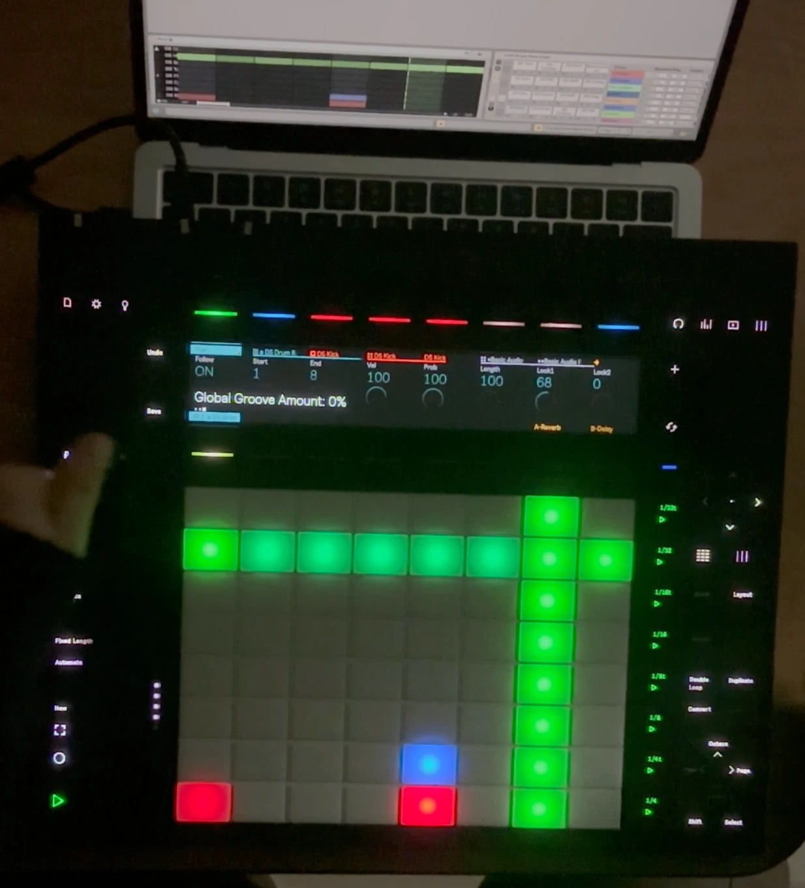

# Puxi

[](LICENSE)



A free, open-source 8-track drum step sequencer for **Ableton Live 12** with deep
**Push 3** integration. Inspired by the OXI One's multi-track view — all of your
drum tracks on one grid at once. All the sequencing logic lives in
version-controlled JavaScript; the Max patch is just plumbing.

## Download

Grab the latest **`Puxi.amxd`** from the
**[Releases page](../../releases/latest)**, move it into your Live User Library (so
your Sets can always find it), and drag it from there onto a MIDI track, before your
Drum Rack. That's it — see the [manual](docs/MANUAL.md) for everything else.

> **Status:** v1.0.0, feature-complete. Tested with Live 12.4 and Push 3.

## Features

- **8×8 grid view** into a 64-step, 32-note pattern — scroll note banks and step
  blocks; piano-roll orientation (lowest note at the bottom).
- **Transport-synced playback** derived from Live's song position (loops/jumps stay
  in sync), MIDI out to a **Drum Rack** (dynamic pad names + colors).
- **Per-step velocity** (brightness), with a global velocity offset.
- **Probability** per step (statistical playback) + a non-destructive global offset.
- **Gate / length** per step: staccato to multi-step **ties** that spill over into
  the next pages/loops (up to 64 steps), + a global offset.
- **Ratcheting** per step (2–8 evenly-spaced sub-hits).
- **Groove / swing** that follows Live's global Groove Amount **and** Swing Amount.
- **Mute / solo**, **polyrhythm** (per-note loop lengths, independent playheads),
  **double-loop (×2)**, **block duplicate**, **delete**.
- **Parameter locks (p-locks):** lock two of a drum pad's device parameters per step,
  plus a per-row offset that shifts the whole row.
- **Export → MIDI clip** (bakes length, probability, ratchet and swing) and
  **import** an existing MIDI clip back into the pattern.
- **Pattern persistence + native undo/redo** (the pattern is a Live parameter).
- **Full Push 3 integration** (tethered *and* standalone): pads with velocity, LED
  mirroring and per-note playheads, dedicated buttons for nav / accent / convert /
  double / duplicate / delete / repeat, and eight encoders shown on the Push display.

See **[docs/MANUAL.md](docs/MANUAL.md)** for the full user manual.

## How Puxi was made

I'm a producer, not a Max developer. Puxi was built with
[Claude Code](https://claude.com/claude-code), Anthropic's AI coding assistant, which
wrote most of the code. My part was deciding what Puxi should be and making sure it
actually works:

- **Design.** What the sequencer does and how it feels in use: the Push gestures, how
  the pads show velocity, probability and ratchets, and the pad colors and brightness
  levels, picked by eye on the hardware.
- **Testing.** Each feature was played in Live, and on a Push 3 where it has a Push
  side, before work on the next one began. When something didn't work or didn't feel
  right, it went back for another round.

The design log, [CLAUDE.md](CLAUDE.md), records the decisions, pitfalls and dead ends
along the way. It's also the file Claude Code reads at the start of every session, so it
doubles as the project's working memory.

The code is open source, so you can read it and judge it for yourself.

## Architecture

- `device/puxi-shell.maxpat` — minimal Max patch shell (clock, MIDI I/O, hosting,
  the exposed Live parameters, and the pattern-persistence sub-patcher).
- `device/puxi-engine.js` — sequencer engine (`v8` object): pattern state, step
  logic, Live API, Push control-surface integration, persistence.
- `device/puxi-gui.js` — GUI (`v8ui` object): the grid rendering and mouse
  interaction (`mgraphics`).

The `.maxpat` + `.js` files are the source of truth. The distributable **frozen
`.amxd`** is generated locally (never committed — it's a binary).

## Getting started

See **[docs/SETUP.md](docs/SETUP.md)** for installation and the test
checklist. In short: the device loads from your Ableton User Library, which links
the `.js` files back to this repo (a single source of truth), and the `.amxd` is rebuilt from
the patch with:

```sh
python3 tools/build-amxd.py
```

Requires Ableton Live 12 with Max 8.6+ (bundled). Push 3 is optional but supported.

## FAQ

**What do I need?** Ableton Live 12 with Max for Live (included in Suite; available
as an add-on for Standard). Puxi is a single `.amxd`: keep it in your User Library and
drop it on the track with your Drum Rack.

**Do I need a Push?** No. The mouse GUI does everything. A Push 3 adds hands-on
pads, encoders and dedicated buttons.

**Does it work on Push 3 standalone?** Yes — transfer the device to the Push and it
runs without a computer. Built and tested on Push 3; Push 2 is untested and
unsupported.

**How much?** Free. No pro version, no unlock, no email wall.

**License?** GPLv3 — use it, study it, modify it, share it; derivatives must stay
open source.

**Melodic sequencing?** It's drum-focused (rows = Drum Rack pads). Export to a MIDI
clip if you want to keep editing in Live.

**Was it made with AI?** Yes, with Claude Code. See
[How Puxi was made](#how-puxi-was-made).

## License

Puxi is free software, licensed under the **GNU General Public License v3.0** —
see [LICENSE](LICENSE). You may use, study, share and modify it; redistributed
versions must stay open under the same license.

Copyright © 2026 mefecit.
